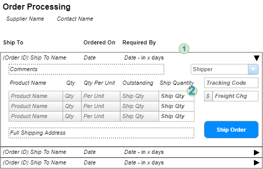

#  Processing - Implementation Plan

> Orders are shipped directly from our suppliers to our customers. As such, suppliers log onto our system to see what orders there are for the products they provide.

## User Interface 

Suppliers will be interacting with a page that shows the following information.


## Implementation

The form will primarily use a '<asp:ListView>' to represent the order **(1)** and show the order items **(2)** in a '<asp.GridView>' inside of the ListView's `<SelectedItemTemplate>`.The controls I will use include:

1. ListView - for the orders
2. GridView - for the products on the order
3. DropDownList - for the Shipper


### Queries/Presentation

### Data Models

``` csharp
public class SupplierSummary 
{
    public int SupplierID { get; set;}
    public string Company { get; set;}
    public string ContactName { get; set;}
}
```

```csharp
public class ShipperSelection
{
    public int ShipperID { get; set;}
    public string Name { get; set;}
}
```

```csharp
public class ProductSummary
{
    public int ProductID { get; set;}
    public string ProductName { get; set;}
    public short Quantity { get; set;}
    public string QtyPerUnit { get; set;}
    public int OutstandingQty { get; set;}
}
```
```csharp
public class OutstandOrder
{
    public int OrderID { get; set;}
    public string ShipToName { get; set;}
    public DateTime OrderedDate { get; set;}
    public DateTime RequiredDate { get; set;}
    public int DaysToDelivery { get; }// Calculated
    public List<ProductSummary>
    OutstandingItems { get; set;}
    public string Comments  { get; set;}
    public string FullShippingAddress { get; set;}
}
```

#### Presentation Layer
 - **Databound Controls ** 
    - **ListViewDataSource** - PRovide data
    for the ListView of orders; call
    `List<OutstandingOrder>
     OrderProcessingConteollwe.LoadOrders(SupplierID)`
 - **DropDownDataSource** - provide data for the DropDown of Shippers; call 
    `List<ShipperSelection>
    OrderProcessingController.ListShippers()`
 - **Page_load88 event - Display the suppliers summary information; call 
    `AupplierSummary OrderProcessingController.GetSupplier(int supplierID)`
 - **ListView** - Use the `<SelectedItemTemplate>` to display the order's details, includeing the `<GridView>` of products on the order.

#### BLL

 The BLL will have a single class called **`OrderProcessingController`** which will have he following methods for querying :
 
 - `List<outstandingOrder> LoadOrders(int supplierId)` - Query the **Customers** **Orders**,**OrderDetails**, and **Products** tables for data on products that come from the `supplierID`.
 - `List<ShipperSelection> ListShippers()` - Query the **Shippers** table.
 - `SupplierSummary GetSupplier(int supplierID) -Query the **Suppliers** table.
### Commands/Processing

#### Data Models

#### Presentation Layer 
- **ShipOrder_click** - Gather information from the form to send the BLL using the 
`void OrderProcessingController.ShipOrder int orderID,ShippingDirections directions,
List <ProductShipment> Item)`.

#### BLL processing 

All the BLL processing of shipping orders must happen as a single transaction.

-` void ShipOrder(int orderID, ShippingDirection directions,
List<ProductShipment> item)`
 - Validatuib of inout:
    - OrdrerId must exist
    - Shipper must exist
    - Must have one or more items to ship 
    - ProductIds must exist/valid
    - Quantities must be greater than 0 and less than the number/qty outstanding on the order
    - Freight charge is either null or a value greater than zero
    - **Add** a new `Shipment` to the databas
    - **Add** new `ManifestItem` Objects to the new shipment